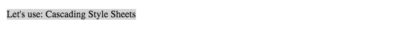

# Lesson: CSS Part 1
 
## Introduction

### Table of Contents

1. [How CSS Works](#How-CSS-Works)
2. [Why CSS](#Why-CSS)
3. [More on Why CSS](#More-on-Why-CSS)
4. [Adding Some Styles](#Adding-Some-Styles)
5. [CSS Syntax](#CSS-Syntax)
6. [Rules](#Rules)
7. [Selectors](#Selectors)
8. [Simple Selectors](#Simple-Selectors)
    1. [Part 1](Part-1)

    2. [Part 2](Part-2)
9. [Attributes Selectors](#Attributes-Selectors)
10. [Pseudo Classes](#Pseudo-classes)
11. [Other Selectors](#Other-Selectors)
12. [CSS Values and units](#CSS-Values-and-units)
13. [Specify Property Values](#Specify-Property-Values)

### [How CSS Works](https://developer.mozilla.org/en-US/docs/Learn/CSS/First_steps/How_CSS_works)

*A 5-7 minute reading*

**Quick Summary**

1. For CSS to work on HTML, the HTML is convert into DOM tree:
        

            Let's use:
             Cascading 
             Style 
             Sheet 
        
    
 

P
|- "Let's use:"
|- SPAN
    |
|   - "Cascading"
|- SPAN
    |
|   - "Style"
|- SPAN
    |
|   - "Sheets"

### [Why CSS](https://www.youtube.com/watch?v=r1xBCi5SOjw)

### [More on Why CSS](https://www.youtube.com/watch?v=s7ONvIgOWdM)

### [Adding Some Styles](https://www.youtube.com/watch?v=uDyd_3xx0Lk)

### [CSS Syntax](https://developer.mozilla.org/en-US/docs/Learn/CSS/First_steps/How_CSS_is_structured)

### [Rules](https://www.youtube.com/watch?v=jVgCN8DoAVY)

### [Selectors](https://developer.mozilla.org/en-US/docs/Learn/CSS/Building_blocks/Selectors)

### Simple Selectors

#### [Part 1](https://developer.mozilla.org/en-US/docs/Learn/CSS/Building_blocks/Selectors/Type_Class_and_ID_Selectors)

#### [Part 2](https://vimeo.com/25121046)

### [Attributes Selectors](https://developer.mozilla.org/en-US/docs/Learn/CSS/Building_blocks/Selectors/Attribute_selectors)

### [Pseudo-classes](https://developer.mozilla.org/en-US/docs/Learn/CSS/Building_blocks/Selectors/Pseudo-classes_and_pseudo-elements)

### [Other Selectors](https://www.youtube.com/watch?v=oh2JLo2yxCM)

### [CSS Values and units](https://developer.mozilla.org/en-US/docs/Learn/CSS/Building_blocks/Values_and_units)

### [Specify Property Values](https://www.youtube.com/watch?v=qrduUUdxBSY)

## Cascading and Inheritance 

### Table of Contents

1. [Cascade and Inheritance](Cascade-and-Inheritance)
2. [The Cascade and Ordering Rules](The-Cascade-and-Ordering-Rules) 
3. [Specificity](Specificity) 
4. [Inheritance](Inheritance)
5. [Display and Visibility](Display-and-Visibility)
6. [Chrome Devtools](Chrome-DevTools)
7. [Developer Tools and CSS](Developer-Tools-and-CSS)

### Cascade and Inheritance 

### The Cascade and Ordering Rules

### Specificity

### Inheritance

### Display and Visibility

### Chrome DevTools

### Developer Tools and CSS

## Styling Text

### Table Of Contents
1. [Fundamental text and tone styling](Fundamental-text-and-tone-styling)
1. [Using font-familu](Using-font-family)

### Fundamental text and tone styling

### Using font-family

## Practice

### Table Of Contents

1. [Step One](Step-One)
2. [Step Two](Step-Two)
3. [Step Three](Step-Three)
4. [Step Four](Step-Four)
4. [Step Five](Step-Five)

*Warning: Try to do it yourself before the walkthrough*

### Step One
1. Use a *San Serif* font for the entire document

### Step Two
2. Center the header horizontally on the page

### Step Three
3. Use uppercase [Roman numerals](https://en.wikipedia.org/wiki/Roman_numerals) for programs offered list instead of [Arabic numerals](https://en.wikipedia.org/wiki/Arabic_numerals)

### Step Four
4. Make it so that links are *only* underlined when *hover* over them

### Step Five
5. Change the color of links to black, and make them bold.

